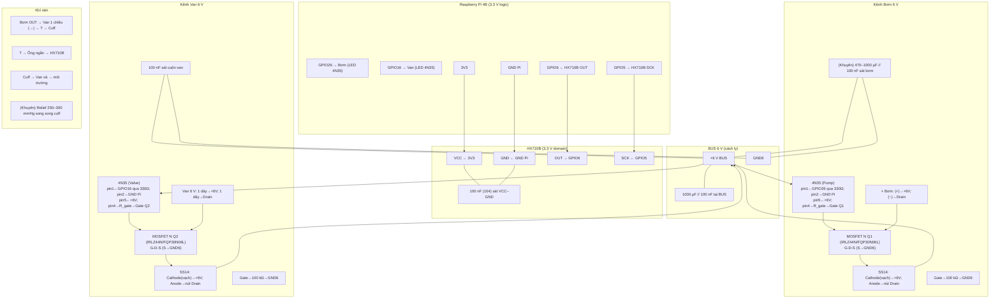
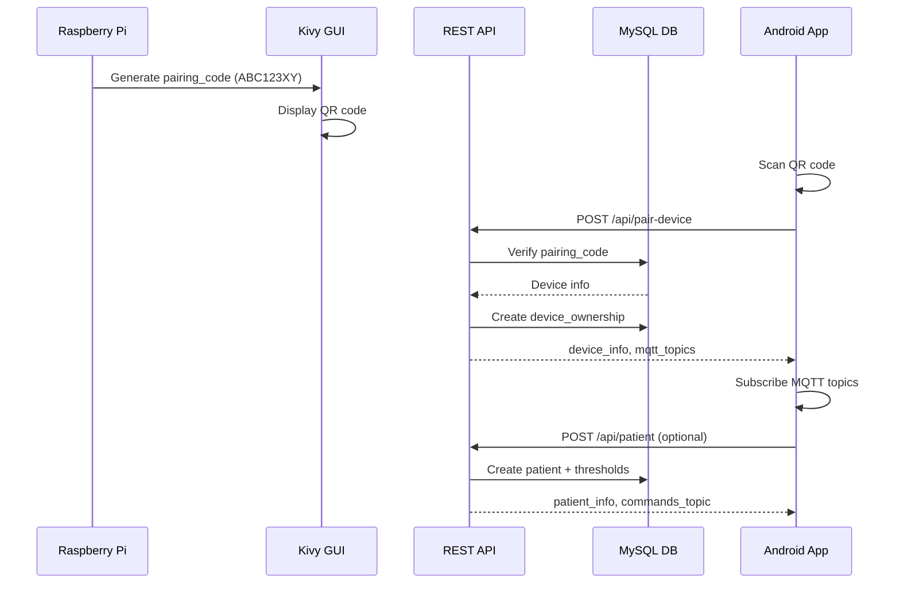
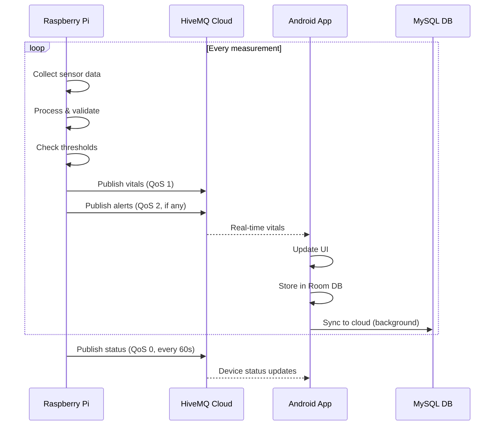
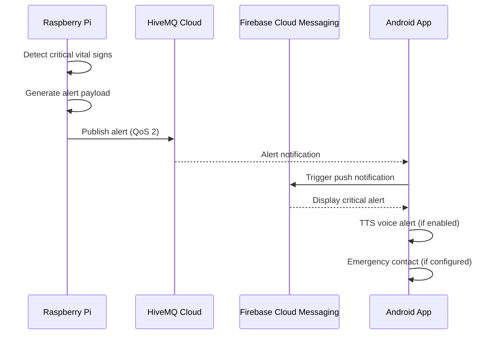
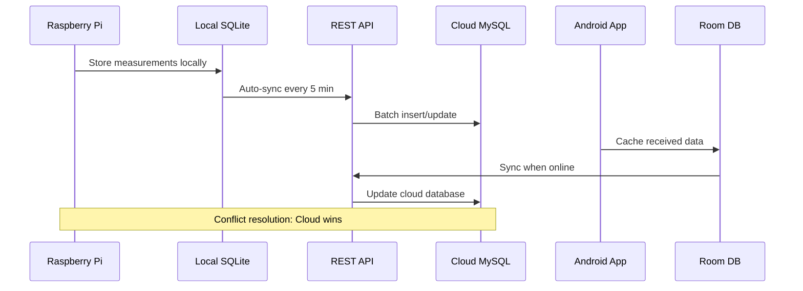

# IoT Health Monitoring System

## Mô tả dự án
Hệ thống IoT theo dõi sức khỏe cho người cao tuổi, đo nhịp tim, SpO2, nhiệt độ, huyết áp với giao diện cải tiến 480x320 trên màn hình SPI 3.5", cảnh báo qua loa và giám sát từ xa qua Android/Web.

## � Quick Links

| Mục | Mô tả |
|-----|-------|
| [🚀 Quick Setup](#quick-setup--run) | Cài đặt nhanh trong 5 phút |
| [🏗️ Kiến trúc](#kiến-trúc-hệ-thống) | Tổng quan hệ thống |
| [🔧 Cấu hình Hardware](#cấu-hình-hardware) | Sơ đồ đấu nối, GPIO mapping |
| [⚙️ Cấu hình Sensors](#cấu-hình-sensors) | Thiết lập cảm biến |
| [📡 API Documentation](docs/REST_API_SPECIFICATION.md) | REST API reference |
| [🗄️ Database Schema](docs/DATABASE_SCHEMA.md) | Cấu trúc database |
| [🔄 System Workflow](#system-workflow) | Luồng hoạt động hệ thống |
| [🧪 Testing](#testing) | Hướng dẫn testing |
| [🚀 Deployment](docs/DEPLOYMENT_STEPS.md) | Triển khai production |
| [❓ FAQ](#faq) | Câu hỏi thường gặp |
| [🐛 Troubleshooting](#troubleshooting-quick-reference) | Xử lý lỗi phổ biến |

## �🚀 Project Status (v2.0 - Production Ready)

| Component | Status | Coverage | Notes |
|-----------|--------|----------|-------|
| **Sensors** | ✅ Production | 100% | MAX30102, MLX90614, HX710B với calibration |
| **GUI** | ✅ Production | 100% | Kivy 480×320 touchscreen, 12 screens |
| **MQTT** | ✅ Production | 100% | HiveMQ Cloud Singapore, TLS, QoS 0-2 |
| **Cloud Sync** | ✅ Production | 100% | AWS RDS MySQL, store-and-forward |
| **REST API** | ✅ Production | 100% | Flask on AWS EC2, device pairing |
| **Alert System** | ✅ Production | 100% | Device-centric, threshold + AI |
| **TTS Audio** | ✅ Production | 100% | PiperTTS vi_VN, 30+ scenarios |
| **Blood Pressure** | ✅ Production | 100% | Oscillometric algorithm, HX710B ADC |
| **Android App** | 🚧 In Progress | 0% | **MVP Target: Q1 2026** (QR pairing, live vitals, history) |
| **Web Dashboard** | 📋 Planned | 0% | MQTT structure ready, UI chưa build |
| **Clinical Validation** | 📋 Planned | 0% | Sau tốt nghiệp (IRB approval required) |  

### Recent Changes (v2.0.2)
- **Device-centric patient resolution**: `patient_id` no longer hardcoded. Devices publish with `device_id`; cloud auto-resolves patient via `devices/patients` mapping.
- **Cloud sync improvement**: `sync_incremental()` now retries all pending alerts & health records before delta sync (fixes stuck pending items).
- **Alert deduplication**: Works across all vital signs (Heart Rate, SpO₂, Temperature, Blood Pressure).
- **Removed deprecated config**: No more hardcoded `patient_id` in `app_config.yaml`; use environment variables for credentials.

### Tính năng mới (v2.0)
- **Giao diện cải tiến**: Dashboard với 3 khối cảm biến lớn, dễ sử dụng trên màn hình cảm ứng
- **Màn hình đo chi tiết**: Giao diện riêng cho từng loại cảm biến với animation và gauge
- **Tối ưu cho touchscreen**: Interface 480x320 với button lớn, text rõ ràng
- **Hoàn toàn bằng tiếng Việt**: Toàn bộ giao diện và thông báo TTS

## Cấu trúc thư mục

```
IoT_health/
├── main.py                 # Entry point chính của ứng dụng
├── requirements.txt        # Danh sách thư viện Python cần thiết
├── .env                   # Biến môi trường
├── README.md              # Tài liệu dự án
├── config/                # Thư mục cấu hình
│   └── app_config.yaml    # File cấu hình chính
├── src/                   # Mã nguồn chính
│   ├── __init__.py
│   ├── sensors/           # Module cảm biến
│   │   ├── __init__.py
│   │   ├── base_sensor.py          # Abstract base class cho sensors
│   │   ├── max30102_sensor.py      # Driver cho MAX30102 (HR/SpO2) - với tích hợp thư viện
│   │   ├── temperature_sensor.py   # Driver cho DS18B20/MLX90614
│   │   └── blood_pressure_sensor.py # Driver cho huyết áp
│   ├── gui/               # Giao diện người dùng (Kivy)
│   │   ├── __init__.py
│   │   ├── main_app.py            # Main Kivy application
│   │   ├── dashboard_screen.py    # Màn hình chính
│   │   ├── bp_measurement_screen.py # Màn hình đo huyết áp
│   │   └── settings_screen.py     # Màn hình cài đặt
│   ├── communication/     # Module liên lạc
│   │   ├── __init__.py
│   │   ├── mqtt_client.py         # MQTT client
│   │   ├── rest_client.py         # REST API client
│   │   └── store_forward.py       # Store-and-forward mechanism
│   ├── data/             # Quản lý dữ liệu
│   │   ├── __init__.py
│   │   ├── models.py             # Database models
│   │   ├── database.py           # Database manager
│   │   └── processor.py          # Data processing
│   ├── ai/               # AI và phân tích
│   │   ├── __init__.py
│   │   ├── alert_system.py       # Hệ thống cảnh báo
│   │   ├── anomaly_detector.py   # Phát hiện bất thường
│   │   ├── trend_analyzer.py     # Phân tích xu hướng
│   │   └── chatbot_interface.py  # Interface chatbot
│   └── utils/            # Tiện ích chung
│       ├── __init__.py
│       ├── logger.py             # Logging utilities
│       ├── config_loader.py      # Configuration loader
│       ├── validators.py         # Data validators
│       └── decorators.py         # Utility decorators
├── data/                 # Thư mục dữ liệu
├── logs/                 # Thư mục log files
└── tests/                # Test cases
    └── __init__.py
```

## Kiến trúc hệ thống

### 1. Sensors Module
- **BaseSensor**: Abstract base class với interface thống nhất
- **MAX30102Sensor**: Đo nhịp tim và SpO2 - **với tích hợp MAX30102 và HRCalc libraries**
- **TemperatureSensor**: Đo nhiệt độ (DS18B20/MLX90614)
- **BloodPressureSensor**: Đo huyết áp oscillometric

#### MAX30102 Library Integration
- **MAX30102Hardware**: Tích hợp trực tiếp từ max30102.py - I2C communication và hardware control
- **HRCalculator**: Tích hợp trực tiếp từ hrcalc.py - Peak detection và SpO2 calculation algorithms
- **Loại bỏ external dependencies**: Không cần cài đặt max30102.py và hrcalc.py riêng biệt

### 2. GUI Module (Kivy)
- **HealthMonitorApp**: Main application controller
- **DashboardScreen**: Hiển thị dashboard chính
- **BPMeasurementScreen**: Màn hình đo huyết áp
- **SettingsScreen**: Cài đặt và cấu hình

### 3. Communication Module
- **MQTTClient**: Real-time data transmission
- **RESTClient**: API calls cho prediction/chat
- **StoreForwardManager**: Offline data management

### 4. Data Module
- **DatabaseManager**: SQLite database operations
- **DataProcessor**: Signal processing và feature extraction
- **Models**: Data models cho Patient, HealthRecord, Alert

### 5. AI Module
- **AlertSystem**: Rule-based và threshold alerts
- **AnomalyDetector**: IsolationForest/LOF cho anomaly detection
- **TrendAnalyzer**: Phân tích xu hướng dài hạn
- **ChatbotInterface**: AI chatbot tư vấn

### 6. Utils Module
- **Logger**: Logging configuration
- **ConfigLoader**: YAML config management
- **DataValidator**: Input validation
- **Decorators**: Retry, timing utilities

## Demo giao diện mới

### Chạy demo GUI với logic cảm biến
```bash
# Demo cơ bản với mock sensors
python demo_enhanced_gui.py

# Test logic tích hợp cảm biến (RECOMMENDED)
python test_sensor_logic.py
```

### Tính năng demo:
- **Dashboard chính**: 3 khối cảm biến với logic thực từ MAX30102/MLX90614
- **MAX30102 Logic**: Finger detection, HR/SpO2 validation, signal quality, buffer management - với tích hợp libraries
- **MLX90614 Logic**: Object/ambient temperature, status codes, smoothing filters
- **Realistic Simulation**: Dữ liệu theo đúng range và validation của sensor thật
- **Status Color Coding**: Màu sắc theo trạng thái critical/warning/normal/partial
- **Measurement Screens**: Logic đo chính xác với stability checking

## Quick Setup & Run

### Prerequisites

#### Phần Cứng (Hardware)
- **Raspberry Pi:**
  - Raspberry Pi 4B (4GB+ RAM khuyến nghị)
  - Raspberry Pi OS Bookworm 64-bit
  - Power supply 5V 3A
  - MicroSD card 16GB+ (Class 10)

- **Màn hình:**
  - SPI LCD 3.5" (480×320, Waveshare compatible)
  - Framebuffer: /dev/fb1

- **Cảm biến (Sensors):**
  - MAX30102: HR/SpO2 sensor (I2C @ 0x57)
  - MLX90614: Infrared temperature sensor (I2C @ 0x5A)
  - HX710B: 24-bit ADC (GPIO5=SCK, GPIO6=DOUT)
  - MPS20N0040D-S: Pressure sensor 0-40 kPa

- **Huyết áp (Blood Pressure System):**
  - Bơm mini 6V (DC pump)
  - Van điện từ 6V (solenoid valve JQF1-6A)
  - Băng bó huyết áp (adult size cuff)
  - Van relief 250-300 mmHg (khuyến nghị)
  - Van 1 chiều (check valve)

- **Mạch điều khiển:**
  - 4N35 optocoupler × 2 (cách ly Pi khỏi 6V domain)
  - MOSFET N-channel × 2 (IRLZ44N hoặc FQP30N06L)
  - Điện trở: 330Ω × 2, 100-220Ω × 2, 68-150kΩ × 2
  - Diode SS14 × 2 (flyback protection)
  - Tụ điện: 1000µF/16V, 470µF/16V, 100nF ceramic × 4

- **Nguồn:**
  - 6V DC cho bơm/van (riêng biệt, cách ly Pi)
  - 3.3V từ Pi cho HX710B

#### Phần Mềm (Software)
- **Python 3.9+** installed on Raspberry Pi OS Bookworm 64-bit
- **pip** for package management
- **MySQL client libraries** (`libmysqlclient-dev`)
- **I2C, SPI enabled** (via `raspi-config`)
- **PiperTTS voice model:** `vi_VN-vais1000-medium.onnx`

#### Dịch vụ Cloud (Cloud Services)
- **AWS RDS MySQL** (hoặc MySQL 8.0+ compatible)
- **HiveMQ Cloud account** (free tier Singapore)
- **(Tùy chọn) Google Gemini API key** cho AI threshold generation

#### Môi trường (Environment)
- SSH hoặc direct terminal access
- Internet connection (cho cloud sync)
- Git for version control

### Step 1: Install Dependencies
```bash
cd /home/pi/Desktop/IoT_health
pip install -r requirements.txt
```

### Step 2: Set Up Environment Variables
Create `.env` file in project root with MQTT & database credentials:
```bash
cat > .env << EOF
# MQTT Configuration (HiveMQ Cloud)
MQTT_BROKER=c8c0b20138314154b4f21f4c7d1e19a5.s1.eu.hivemq.cloud
MQTT_PORT=8883
MQTT_USERNAME=rpi_bp_001
MQTT_PASSWORD=your_hivemq_password_here

# MySQL Cloud (AWS RDS)
MYSQL_HOST=database-1.cba08ks48qdc.ap-southeast-1.rds.amazonaws.com
MYSQL_PORT=3306
MYSQL_USER=pi_sync
MYSQL_PASSWORD=your_mysql_password_here
MYSQL_DATABASE=iot_health_cloud

# Device Configuration
DEVICE_ID=rpi_bp_001
EOF
```
**Security Note**: Never commit `.env` to git. Add `.env` to `.gitignore`.

### Step 3: Initialize Local Database
```bash
# Create SQLite database with schema
python scripts/init_database.py

# Verify database created at data/health_monitor.db
ls -lh data/health_monitor.db
```

### Step 4: Configure Application
Edit `config/app_config.yaml` to set:
- Device settings (device_id, location)
- Sensor calibration (HX710B offset/slope, temperature offset)
- Alert thresholds (HR, SpO2, Temperature, Blood Pressure)
- MQTT broker credentials (loaded from .env)

Example key settings:
```yaml
device:
  device_id: rpi_bp_001

sensors:
  hx710b:
    calibration:
      offset_counts: 0
      slope_mmhg_per_count: 0.001
      
alerts:
  thresholds:
    heart_rate:
      min_normal: 60
      max_normal: 100
      critical_min: 40
      critical_max: 150
```

### Step 5: Test MQTT Connection
```bash
# Verify broker connectivity
python scripts/test_hivemq_connection.py

# Expected output:
# ✅ Connected to MQTT broker
# ✅ Subscribed to device status topics
# ✅ Connection healthy
```

### Step 6: Run Application
```bash
# Start main health monitoring app
python main.py

# Expected output:
# [INFO] Initializing sensors...
# [INFO] Connecting to MQTT broker...
# [INFO] Kivy GUI starting (480x320)...
# [INFO] Ready to measure
```

### Step 7: Test Alert Sync (Optional)
In another terminal, run sync test:
```bash
# Test cloud sync and alert retry logic
python tests/test_auto_sync.py

# Expected output:
# Testing alert sync to cloud...
# ✅ Created 5 test alerts
# ✅ Synced 5 alerts to MySQL
# ✅ Verified sync_status='synced'
```

### Troubleshooting Quick Reference
| Issue | Solution |
|-------|----------|
| `Import error: No module named 'kivy'` | Run: `pip install -r requirements.txt` |
| `MQTT connection timeout` | Check internet connection, verify broker credentials in `.env` |
| `SQLite "database is locked"` | Ensure only one instance of app running |
| `HX710B DOUT timeout` | Verify GPIO5/GPIO6 wiring, HX710B power supply |
| `No display on LCD` | Check SPI enabled (`raspi-config`), verify `app_config.yaml` display settings |

## Cài đặt và chạy

### Yêu cầu hệ thống
- Raspberry Pi 4B 8GB
- Raspberry Pi OS 64-bit Bookworm
- Python 3.9+
- SPI LCD 3.5" Waveshare

### Cài đặt dependencies
```bash
pip install -r requirements.txt
```

### Cấu hình hardware
1. Kết nối sensors theo schema trong config
2. Enable SPI và I2C trong raspi-config
3. Cấu hình SPI LCD overlay

### Chạy ứng dụng
```bash
python main.py
```

## Tính năng chính

### Phase 1 - Core Foundation
- [x] Cấu trúc project và architecture
- [ ] Basic sensor reading (MAX30102, DS18B20)
- [ ] Simple GUI display
- [ ] Threshold-based alerts

### Phase 2 - Communication
- [x] MQTT client implementation (test.mosquitto.org:1883)
- [x] MQTT payload schemas (VitalsPayload, AlertPayload, DeviceStatusPayload)
- [x] REST API client framework
- [x] Store-forward offline support
- [x] Cloud sync with MySQL (AWS RDS) + device-centric patient resolution

### Phase 3 - Advanced Features
- [x] Blood pressure measurement (HX710B oscillometric method)
- [x] AI anomaly detection (IsolationForest framework)
- [x] Android app design (Kotlin + Jetpack Compose)
- [x] Multi-device management (QR code pairing)
- [x] Alert sync with cloud retry logic (retries pending items)
- [ ] Android app implementation (in progress)
- [ ] Web dashboard

### Phase 4 - Optimization
- [ ] Performance tuning
- [ ] Security hardening
- [ ] Clinical validation

## Cấu hình Hardware

### 1. Sơ đồ khối & chức năng

* **Raspberry Pi 4B (3.3 V, logic):**
  Điều khiển bơm/van qua **optocoupler 4N35** (cách ly), đọc áp suất từ **HX710B (24-bit)**.
* **Miền công suất 6 V (cách ly Pi):**
  **4N35 → MOSFET N (IRLZ44N/FQP30N06L)** đóng/ngắt **bơm 6 V** & **van xả 6 V**.
  Có **diode flyback SS14**, **tụ lọc tổng 1000 µF + 100 nF** và **tụ cục bộ sát bơm**.
* **Khí nén:** Bơm → **van 1 chiều (→ cuff)** → T → cuff & nhánh cảm biến → **van xả** ra môi trường; **van relief (250–300 mmHg)** (khuyên dùng).

### 2. Mapping chân GPIO (BCM) – phiên bản mới

| Khối            | Tín hiệu            |       GPIO (BCM) | Ghi chú                         |
| --------------- | ------------------- | ---------------: | ------------------------------- |
| **Bơm (Q1)**    | Điều khiển LED 4N35 |       **GPIO26** | Output, mặc định LOW            | 
| **Van xả (Q2)** | Điều khiển LED 4N35 |       **GPIO16** | Output, mặc định LOW            |
| **HX710B**      | OUT (data ready)    |        **GPIO6** | Input (có thể dùng pull-up nhẹ) |
| **HX710B**      | SCK (clock)         |        **GPIO5** | Output                          |
| **HX710B**      | VCC/GND             | **3V3 / GND Pi** | Cùng miền 3.3 V với Pi          |

> Miền **6 V công suất** (bơm/van/MOSFET) **không** nối GND với Pi (đã cách ly qua 4N35).
> Chỉ riêng **HX710B** là chung GND với Pi.

### 3. Đi dây điện – chuẩn kỹ thuật

#### 3.1 Cách ly điều khiển (mỗi kênh bơm/van)

* **GPIO → R_LED 330 Ω → 4N35 pin1 (Anode); 4N35 pin2 (Cathode) → GND Pi.**
* **4N35 pin5 (Collector) → +6 V BUS** ; **pin4 (Emitter) → R_gate 100–220 Ω → Gate MOSFET**.
* **Gate MOSFET → R_pull-down 68–150 kΩ → GND6** (mặc định OFF).

#### 3.2 MOSFET & tải

* **MOSFET (mặt chữ): G–D–S.**
  **S → GND6**, **D → cực "−" của tải** (bơm/van), **cực "+" tải → +6 V BUS**.
* **Diode SS14:** **Cathode (vạch trắng) → +6 V BUS**, **Anode → nút Drain/tải −**.
* **Tụ:** **1000 µF // 100 nF** tại **BUS 6 V**; (khuyên) **470–1000 µF // 100 nF** **sát cọc bơm** (nếu dây dài).

#### 3.3 HX710B (3.3 V domain)

* **VCC → 3V3**, **GND → GND Pi**, **OUT → GPIO6**, **SCK → GPIO5**, **100 nF (104)** sát **VCC–GND** của module.
* Ống khí cảm biến **ngắn & kín**.

### 4. Khí nén – đúng chiều

* **Bơm OUT → van 1 chiều (mũi tên hướng → cuff) → T → cuff**
* Nhánh **T → cổng cảm biến HX710B** (ống ngắn).
* **Cuff → van xả JQF1-6A** ra môi trường.
* **Relief 250–300 mmHg** song song cuff (khuyến nghị an toàn cứng).

### 5. Sơ đồ tổng thể (Mermaid – mapping mới)



### 6. Kiểm tra trước khi cấp điện (tối quan trọng)

1. **Điện trở & diode:**
   Gate↔GND6 đo ~**68–150 kΩ**; **diode SS14** đo chiều thuận ~0.2–0.4 V, nghịch **không dẫn**; **vạch trắng** về **+6 V**.
2. **Tụ hóa:** **"+" → +6 V**, **"−" → GND6** (thân tụ vạch dấu "−").
3. **4N35:** LED đúng cực (**pin1 Anode**, **pin2 Cathode**); transistor **pin5 → +6 V**, **pin4 → Gate qua 100–220 Ω**.
4. **Nguồn:** Cấp **6 V** cho khối công suất (**Pi chưa cấp**) → bơm/van **không tự chạy**. Sau đó cấp **5 V** cho Pi.

## Cấu hình Sensors

### Sensors Configuration
- **MAX30102**: I2C address 0x57, INT pin GPIO4 (HR/SpO2 sensor)
- **MLX90614**: I2C address 0x5A (temperature sensor)
- **HX710B**: GPIO5 (SCK), GPIO6 (DOUT) - Blood pressure sensor
- **Blood Pressure Control**:
  - Pump: GPIO26 (via 4N35 optocoupler)
  - Valve: GPIO16 (via 4N35 optocoupler)
  - Power: 6V BUS (isolated from Pi)

### Display
- SPI LCD 3.5": /dev/fb1, resolution 480x320
- Kivy framebuffer rendering

### Communication

#### MQTT Configuration (HiveMQ Cloud - Production)
- **Broker**: c8c0b20138314154b4f21f4c7d1e19a5.s1.eu.hivemq.cloud
- **Port**: 8883 (TLS required)
- **WebSocket Port**: 8884 (for web dashboard)
- **Region**: Singapore (Free Tier)
- **Credentials**: 
  - Pi Device: `rpi_bp_001` (username), password in .env
  - Android App: `android_app` (username), password in .env
  - Web Dashboard: `web_dashboard` (username) - *deferred*
- **Client ID**: rpi_bp_001 (device_id from config)
- **TLS**: Required (system CA certificates - Let's Encrypt)
- **QoS Levels**: 
  - Vitals: QoS 1 (at least once)
  - Alerts: QoS 2 (exactly once)
  - Status: QoS 0 (fire and forget)
  - Commands: QoS 2 (exactly once)
- **Last Will & Testament**: Enabled (offline notification)
- **Auto-reconnect**: Exponential backoff (5s, 10s, 20s, 40s, 60s max)

#### MQTT Topics Structure
```yaml
# Pi → Cloud/App (Publish)
iot_health/device/{device_id}/vitals:
  QoS: 1
  Payload: VitalsPayload (JSON với HR, SpO2, Temp, BP + raw metrics)
  Frequency: Mỗi lần đo xong

iot_health/device/{device_id}/alerts:
  QoS: 2
  Payload: AlertPayload (JSON với alert_type, severity, recommendations)
  Trigger: Khi vượt ngưỡng

iot_health/device/{device_id}/status:
  QoS: 0
  Payload: DeviceStatusPayload (JSON với sensors, battery, system health)
  Frequency: Heartbeat mỗi 60s

# Cloud/App → Pi (Subscribe)
iot_health/patient/{patient_id}/commands:
  QoS: 2
  Payload: CommandPayload (JSON với command, parameters)
  Examples: start_measurement, calibrate_sensor, emergency_deflate

iot_health/patient/{patient_id}/predictions:
  QoS: 1
  Payload: AI predictions từ cloud
```

#### REST API Server (Production - AWS EC2)
- **Server**: http://47.130.193.237:8000 (AWS EC2 Ubuntu)
- **Framework**: Flask + Gunicorn + systemd
- **Database**: MySQL 8.0.44 (AWS RDS)
- **Authentication**: None (planned JWT)
- **Rate Limiting**: None (planned)
- **CORS**: Enabled for Android/Web clients

#### REST API Endpoints

##### Health Check
```http
GET /api/health
```
**Response:**
```json
{
  "status": "ok",
  "database": "connected",
  "timestamp": "2025-11-18T10:30:00.000000",
  "version": "1.0.0"
}
```

##### Device Pairing
```http
POST /api/pair-device
Content-Type: application/json

{
  "pairing_code": "ABC123XY",
  "user_id": "user_001",
  "nickname": "Living Room Monitor"
}
```
**Success Response:**
```json
{
  "status": "success",
  "message": "Device paired successfully",
  "data": {
    "device_info": {
      "device_id": "rpi_bp_001",
      "device_name": "Living Room Monitor",
      "device_type": "raspberry_pi_4b",
      "location": "Home - Living Room",
      "nickname": "Living Room Monitor"
    },
    "patient_info": null,
    "mqtt_topics": {
      "vitals": "iot_health/device/rpi_bp_001/vitals",
      "alerts": "iot_health/device/rpi_bp_001/alerts",
      "status": "iot_health/device/rpi_bp_001/status",
      "commands": null
    },
    "thresholds": {}
  }
}
```

##### Add Patient Information
```http
POST /api/patient
Content-Type: application/json

{
  "device_id": "rpi_bp_001",
  "user_id": "user_001",
  "name": "Nguyễn Văn A",
  "age": 65,
  "gender": "M",
  "medical_conditions": {
    "hypertension": true,
    "diabetes": false,
    "heart_disease": false,
    "notes": "Cao huyết áp từ 2020"
  },
  "emergency_contact": {
    "name": "Nguyễn Thị B",
    "relationship": "Con gái",
    "phone": "0912345678"
  }
}
```
**Success Response:**
```json
{
  "status": "success",
  "message": "Patient information saved successfully",
  "data": {
    "patient_id": "patient_rpi_bp_001_user_001",
    "name": "Nguyễn Văn A",
    "age": 65,
    "gender": "M",
    "medical_conditions": {
      "hypertension": true,
      "diabetes": false,
      "heart_disease": false,
      "notes": "Cao huyết áp từ 2020"
    },
    "emergency_contact": {
      "name": "Nguyễn Thị B",
      "relationship": "Con gái",
      "phone": "0912345678"
    },
    "mqtt_commands_topic": "iot_health/patient/patient_rpi_bp_001_user_001/commands"
  }
}
```

##### Get User Devices
```http
GET /api/devices/{user_id}
```
**Success Response:**
```json
{
  "status": "success",
  "devices": [
    {
      "device_id": "rpi_bp_001",
      "device_name": "Living Room Monitor",
      "device_type": "raspberry_pi_4b",
      "location": "Home - Living Room",
      "nickname": "Living Room Monitor",
      "last_seen": "2025-11-18T08:00:00.000000",
      "is_active": 1,
      "patient_id": "patient_rpi_bp_001_user_001",
      "patient_name": "Nguyễn Văn A",
      "age": 65,
      "gender": "M"
    }
  ]
}
```

#### REST API Error Responses
```json
// 400 Bad Request
{
  "status": "error",
  "message": "Missing required fields: pairing_code, user_id, nickname"
}

// 403 Forbidden
{
  "status": "error",
  "message": "User does not own this device"
}

// 409 Conflict
{
  "status": "error",
  "message": "Device already paired with this user"
}

// 500 Internal Server Error
{
  "status": "error",
  "message": "Database error: Connection timeout"
}
```

#### Cloud Database (MySQL)
- **Host**: database-1.cba08ks48qdc.ap-southeast-1.rds.amazonaws.com:3306 (AWS RDS)
- **Database**: iot_health_cloud
- **Engine**: MySQL 8.0.44
- **Charset**: utf8mb4_unicode_ci
- **Tables**:

  **Core Tables:**
  - `devices` - Device registry với pairing fields (device_id, device_name, location, pairing_code, device_type)
  - `device_ownership` - Multi-user device access control (user_id, device_id, role, nickname)
  - `patients` - Patient information (patient_id, name, age, gender, device_id, emergency_contact)
  - `health_records` - Vitals history (id, patient_id, device_id, timestamp, heart_rate, spo2, temperature, systolic_bp, diastolic_bp, mean_arterial_pressure, sensor_data, data_quality, measurement_context, synced_at, sync_status)
  - `alerts` - Alert history với severity levels (id, patient_id, device_id, alert_type, severity, message, vital_sign, current_value, threshold_value, timestamp, acknowledged, resolved, notification_sent, notification_method)

  **Configuration Tables:**
  - `patient_thresholds` - Personalized vital sign thresholds (patient_id, vital_sign, min_normal, max_normal, min_critical, max_critical)
  - `sensor_calibrations` - Sensor calibration data (device_id, sensor_name, calibration_type, reference_values, measured_values, calibration_factors)

  **Sync & Logging Tables:**
  - `sync_queue` - Store-and-forward queue (device_id, table_name, operation, record_id, data_snapshot, sync_status, sync_attempts)
  - `system_logs` - System event logs với partitioning (device_id, level, message, module, timestamp, additional_data)

  **Views (Analytics):**
  - `v_active_alerts` - Active alerts with patient/device info
  - `v_alert_summary` - Alert statistics by date/severity
  - `v_daily_summary` - Daily system metrics
  - `v_data_quality` - Data quality analytics
  - `v_device_health` - Device status and health metrics
  - `v_device_status` - Device overview
  - `v_error_dashboard` - Error monitoring dashboard
  - `v_hourly_activity` - Hourly activity patterns
  - `v_latest_vitals` - Latest vital signs per patient
  - `v_patient_vitals_trend` - Vital trends analysis
  - `v_sync_performance` - Sync performance metrics
  - `v_sync_queue_status` - Sync queue monitoring
  - `v_system_status` - System health overview

  **Stored Procedures:**
  - `sp_cleanup_old_records(days_to_keep)` - Data retention management
  - `sp_patient_statistics(patient_id)` - Patient statistics calculation

#### Local Database (SQLite)
- **Path**: data/health_monitor.db
- **Purpose**: Local cache, offline mode (7 days)
- **Tables**: alerts, health_records, patients, patient_thresholds, sensor_calibrations, system_logs
- **Sync Strategy**: Auto-sync mỗi 5 phút, conflict resolution (cloud wins)
- **Note**: Simplified schema without partitioning, foreign keys optional

#### REST API (Planned)
- **Server**: http://localhost:8000 hoặc cloud endpoint
- **Endpoints**:
  - `GET /api/v1/devices` - List devices
  - `POST /api/v1/pair-device` - Device pairing
  - `GET /api/v1/health-records` - Historical data
  - `GET /api/v1/trend-analysis` - AI trend analysis
  - `POST /api/v1/chat-with-ai` - Chatbot interface

## Bảo mật
- MQTT over TLS
- JWT authentication cho REST API
- Input validation và sanitization
- Hardware safety interlocks

## Monitoring và Logging
- Structured logging với rotation
- Health metrics collection
- Error tracking và alerting
- Performance monitoring

## MQTT Payload Schemas

### VitalsPayload Example
```json
{
  "timestamp": 1699344000.5,
  "device_id": "rpi_bp_001",
  "patient_id": "patient_001",
  "measurements": {
    "heart_rate": {
      "value": 85,
      "unit": "bpm",
      "valid": true,
      "confidence": 0.95,
      "source": "MAX30102",
      "raw_metrics": {
        "ir_quality": 50000,
        "peak_count": 142,
        "sampling_rate": 50.0
      }
    },
    "spo2": {
      "value": 98,
      "unit": "%",
      "valid": true,
      "confidence": 0.92,
      "source": "MAX30102",
      "raw_metrics": {
        "r_value": 0.85,
        "ac_red": 48000,
        "dc_red": 1000000
      }
    },
    "temperature": {
      "object_temp": 36.8,
      "ambient_temp": 29.5,
      "unit": "celsius",
      "valid": true,
      "source": "MLX90614"
    },
    "blood_pressure": {
      "systolic": 120,
      "diastolic": 80,
      "map": 93,
      "unit": "mmHg",
      "valid": true,
      "quality": "good",
      "confidence": 0.88,
      "source": "HX710B",
      "raw_metrics": {
        "max_counts": 125000,
        "map_counts": 115000,
        "samples_collected": 450,
        "sampling_rate": 10.0,
        "oscillation_amplitude": 15.5,
        "envelope_quality": 0.85
      }
    }
  },
  "session": {
    "session_id": "session_20251108_143000",
    "measurement_sequence": 1,
    "total_duration": 45.2,
    "user_triggered": true
  }
}
```

### AlertPayload Example
```json
{
  "timestamp": 1699344100.5,
  "device_id": "rpi_bp_001",
  "patient_id": "patient_001",
  "alert_type": "high_blood_pressure",
  "severity": "critical",
  "priority": 1,
  "current_measurement": {
    "vital_sign": "blood_pressure",
    "systolic": 185,
    "diastolic": 95,
    "map": 125
  },
  "thresholds": {
    "systolic_max": 180,
    "diastolic_max": 90
  },
  "trend": {
    "direction": "increasing",
    "rate_of_change": 5.2
  },
  "actions": {
    "emergency_call_suggested": true,
    "medication_reminder": true
  },
  "recommendations": [
    "Uống thuốc huyết áp ngay",
    "Nghỉ ngơi và thư giãn",
    "Gọi bác sĩ nếu không giảm trong 30 phút"
  ],
  "metadata": {
    "alert_id": "alert_20251108_143100",
    "notification_sent": true,
    "tts_spoken": true
  }
}
```

## Android App Integration

### App Architecture
- **Language**: Kotlin
- **UI Framework**: Jetpack Compose
- **Architecture**: MVVM + Clean Architecture
- **DI**: Hilt
- **Local DB**: Room (SQLite cache)
- **MQTT**: Paho Android MQTT client
- **Charts**: MPAndroidChart
- **QR Scanner**: ZXing

### Key Features
- **Multi-device management**: Quản lý nhiều Raspberry Pi devices
- **QR code pairing**: Ghép nối device qua QR code (pairing_code)
- **Real-time monitoring**: MQTT wildcard subscription `iot_health/device/+/#`
- **Offline mode**: Room cache 7 ngày, auto-sync khi online
- **Push notifications**: Critical alerts qua Firebase Cloud Messaging
- **Charts & analytics**: Trends, statistics, export CSV/PDF
- **Role-based access**: Owner, Admin, Caregiver, Viewer

### Device Pairing Flow
1. Pi generates pairing_code (6-8 chars: ABC123XY)
2. Display QR code on Kivy GUI (Settings → Pairing)
3. Android app scan QR hoặc nhập code manual
4. **REST API call**: `POST /api/pair-device` với pairing_code, user_id, nickname
5. **Response**: device_info, mqtt_topics, patient_info=null, thresholds={}
6. **Optional**: Add patient info via `POST /api/patient`
7. Create ownership: `INSERT INTO device_ownership (user_id, device_id, role)`
8. Subscribe MQTT: `iot_health/device/{device_id}/#`
9. Start real-time monitoring

### Documentation
- **Implementation Guide**: `docs/ANDROID_APP_IMPLEMENTATION_GUIDE.md`
- **MySQL Setup**: `docs/MYSQL_SETUP_COMPLETED.md`
- **MQTT Test**: `tests/test_mqtt_connection.py`

## System Workflow

### Complete IoT Health Monitoring Flow

```mermaid
graph TB
    subgraph "Raspberry Pi (IoT Device)"
        subgraph "Sensors"
            MAX30102[MAX30102<br/>HR/SpO2]
            MLX90614[MLX90614<br/>Temperature]
            HX710B[HX710B<br/>Blood Pressure]
        end
        
        subgraph "Data Processing"
            SensorLogic[Sensor Logic<br/>Validation & Processing]
            AlertSystem[Alert System<br/>Threshold Checking]
        end
        
        subgraph "Communication"
            MQTTClient[MQTT Client<br/>Paho MQTT]
            RESTClient[REST Client<br/>For pairing]
        end
        
        subgraph "Local Storage"
            SQLite[(SQLite<br/>Local Cache)]
        end
        
        MAX30102 --> SensorLogic
        MLX90614 --> SensorLogic
        HX710B --> SensorLogic
        SensorLogic --> AlertSystem
        AlertSystem --> MQTTClient
        MQTTClient --> RESTClient
        SensorLogic --> SQLite
    end
    
    subgraph "Cloud Infrastructure"
        subgraph "MQTT Broker"
            HiveMQ[HiveMQ Cloud<br/>Singapore<br/>Port: 8883 (TLS)]
        end
        
        subgraph "REST API Server"
            FlaskAPI[Flask API<br/>AWS EC2<br/>Port: 8000]
        end
        
        subgraph "Database"
            MySQL[(MySQL 8.0.44<br/>AWS RDS<br/>iot_health_cloud)]
        end
        
        HiveMQ --> FlaskAPI
        FlaskAPI --> MySQL
    end
    
    subgraph "Android Mobile App"
        subgraph "UI Layer"
            ComposeUI[Jetpack Compose<br/>Material 3]
            QRScanner[QR Scanner<br/>ZXing]
        end
        
        subgraph "Business Logic"
            ViewModels[ViewModels<br/>MVVM]
            Repositories[Repositories<br/>Data Access]
        end
        
        subgraph "Data Layer"
            RoomDB[(Room DB<br/>SQLite Cache)]
            MQTTAndroid[MQTT Client<br/>Paho Android]
            Retrofit[Retrofit<br/>REST API]
        end
        
        subgraph "Services"
            FCM[Firebase Cloud<br/>Messaging]
            WorkManager[Work Manager<br/>Background Tasks]
        end
        
        ComposeUI --> ViewModels
        QRScanner --> ViewModels
        ViewModels --> Repositories
        Repositories --> RoomDB
        Repositories --> MQTTAndroid
        Repositories --> Retrofit
        MQTTAndroid --> FCM
        ViewModels --> WorkManager
    end
    
    %% Data Flow
    MQTTClient --> HiveMQ
    HiveMQ --> MQTTAndroid
    
    RESTClient --> FlaskAPI
    Retrofit --> FlaskAPI
    
    FlaskAPI --> MySQL
    RoomDB --> MySQL
    
    %% Status Flow
    MQTTClient -.->|Status Updates| HiveMQ
    HiveMQ -.->|Real-time Data| MQTTAndroid
    AlertSystem -.->|Alerts| FCM
    
    %% Pairing Flow
    QRScanner -.->|Scan QR Code| RESTClient
    RESTClient -.->|Pair Device| FlaskAPI
    FlaskAPI -.->|Device Info| Retrofit
    
    %% Patient Management
    ComposeUI -.->|Add Patient| Retrofit
    Retrofit -.->|Patient Data| FlaskAPI
    FlaskAPI -.->|Store Patient| MySQL
    
    %% Sync Flow
    SQLite -.->|Auto Sync| MySQL
    RoomDB -.->|Offline Cache| MySQL
```

### Detailed Workflow Steps

#### 1. Device Setup & Pairing


#### 2. Real-time Monitoring Flow


#### 3. Alert & Notification Flow


#### 4. Data Synchronization Flow


### Data Flow Summary

| Component | Input | Processing | Output |
|-----------|-------|------------|--------|
| **Raspberry Pi** | Sensor data | Validation, Alert checking | MQTT vitals/alerts/status |
| **REST API** | HTTP requests | Business logic, DB operations | JSON responses |
| **MySQL DB** | SQL queries | Data persistence | Query results |
| **MQTT Broker** | MQTT messages | Message routing | Topic distribution |
| **Android App** | MQTT messages, API responses | UI updates, Local storage | User interactions |

### Error Handling & Recovery

#### Connection Failures
- **MQTT**: Auto-reconnect with exponential backoff (5s → 60s)
- **REST API**: Retry with circuit breaker pattern
- **Database**: Connection pooling, failover to local cache

#### Data Consistency
- **Optimistic locking** for concurrent updates
- **Store-and-forward** for offline scenarios
- **Conflict resolution** policies (cloud wins)

#### Monitoring & Alerts
- **Health checks** every 30 seconds
- **Error logging** with structured format
- **Performance metrics** collection
- **Automated recovery** procedures

---

## Testing

### Chiến lược Testing (Testing Strategy)

#### Unit Tests - Kiểm tra từng module riêng lẻ
```bash
# Test cảm biến MAX30102
python tests/test_sensors.py --sensor max30102

# Test cảm biến MLX90614
python tests/test_sensors.py --sensor mlx90614

# Test HX710B driver
python tests/test_hx710b_driver.py

# Test database operations
python tests/test_database.py

# Test data validation
python -m pytest tests/ -k "test_validator"
```

#### Integration Tests - Kiểm tra tích hợp giữa các module
```bash
# Test toàn bộ quy trình đo huyết áp
python tests/test_full_bp_measurement.py

# Test cloud sync (SQLite → MySQL)
python tests/test_auto_sync.py

# Test MQTT publish/subscribe
python tests/test_hivemq_connection.py

# Test Phase 3 integration (sensors + GUI + MQTT + DB)
python tests/test_phase3_integration.py

# Test connection quality
python tests/test_connection_quality.py
```

#### Hardware Calibration Tests - Hiệu chuẩn phần cứng
```bash
# Hiệu chuẩn HX710B ADC (blood pressure sensor)
python tests/bp_calib_tool.py

# Kiểm tra zero offset của HX710B
python tests/check_zero_offset.py

# Hiệu chuẩn offset temperature
python tests/calibrate_offset.py

# Validate inflate pressure
python tests/test_inflate_validation.py

# Capture BP waveform data
python tests/capture_bp_data.py
```

#### System Tests - Kiểm tra toàn hệ thống
```bash
# Test bơm/van pneumatic
python tests/test_bom_van.py

# Test TTS voice output
python tests/test_speak.py

# Test threshold với tiếng Việt
python tests/test_htn_vietnamese.py

# Monitor MQTT traffic
python scripts/mqtt_monitor.py
```

#### Performance Tests - Đo hiệu năng
```bash
# Test timing của HX710B
python tests/test_hx710b_timing.py

# Analyze BP envelope
python tests/analyze_envelope.py
```

### HiveMQ Cloud Connection Test
```bash
# CRITICAL: Set MQTT password in .env first
nano .env
# Replace <REPLACE_WITH_YOUR_HIVEMQ_PASSWORD> with your actual password

# Test HiveMQ Cloud connectivity (3 tests)
python tests/test_hivemq_connection.py

# Expected output:
# ✅ Test 1: Basic Connection - Connects to HiveMQ Cloud, verifies TLS
# ✅ Test 2: Publish Vitals - Sends sample vitals payload to broker
# ✅ Test 3: Subscribe Commands - Listens for commands from Android/Web
```

### Legacy MQTT Test
```bash
# Test MQTT broker connectivity (test.mosquitto.org - deprecated)
python tests/test_mqtt_connection.py

## FAQ

### Câu hỏi thường gặp (Frequently Asked Questions)

#### 1. Tôi có thể dùng MQTT broker khác thay HiveMQ Cloud không?
**Trả lời:** Có, bạn có thể dùng bất kỳ MQTT broker nào hỗ trợ MQTT v3.1.1. Chỉnh sửa file `config/app_config.yaml` → `communication.mqtt.broker` và cập nhật credentials trong `.env`. 

**Lưu ý:** HiveMQ Cloud được khuyến nghị vì:
- TLS/SSL tích hợp sẵn (bảo mật)
- Free tier 100 connections
- Singapore region (latency thấp cho Việt Nam)
- WebSocket support cho web dashboard

#### 2. Làm sao để thêm thông tin bệnh nhân?
**Trả lời:** Hiện tại có 3 cách:
1. **Qua Android app** (đang phát triển, MVP Q1 2026): Giao diện đồ họa thân thiện
2. **Qua REST API:** `POST /api/patient` với JSON payload (xem [REST_API_SPECIFICATION.md](docs/REST_API_SPECIFICATION.md))
3. **Direct MySQL insert:** Kết nối MySQL workbench và INSERT vào table `patients` (xem [DATABASE_SCHEMA.md](docs/DATABASE_SCHEMA.md))

#### 3. HX710B timeout "DOUT not ready" - làm sao khắc phục?
**Trả lời:** Lỗi này do HX710B không trả tín hiệu. Kiểm tra:
1. **Wiring:** GPIO5 → SCK, GPIO6 → DOUT, 3.3V → VCC, GND → GND
2. **Power supply:** HX710B cần 3.3V ổn định (đo điện áp tại chân VCC)
3. **Sensor connection:** Kiểm tra dây nối từ HX710B đến MPS20N0040D (4 dây)
4. **GPIO conflicts:** Đảm bảo không có module khác dùng GPIO5/GPIO6
5. **Test:** Chạy `python tests/test_hx710b_driver.py` để debug

#### 4. Tôi có thể chạy hệ thống mà không sync cloud không?
**Trả lời:** Có, hệ thống có thể hoạt động hoàn toàn offline. Thực hiện:
1. Chỉnh sửa `config/app_config.yaml`:
   ```yaml
   cloud:
     enabled: false
   ```
2. Dữ liệu sẽ chỉ lưu trong SQLite local (`data/health_monitor.db`)
3. Giới hạn lưu trữ: 7 ngày (có thể tăng trong config)
4. Không có MQTT real-time monitoring (trừ khi dùng local broker)

#### 5. Làm sao để ghép nối device với Android app?
**Trả lời:** Quy trình device pairing:
1. Trên Raspberry Pi: Mở **Settings** → **Pairing** → Hiển thị QR code
2. Trên Android app: Quét QR code hoặc nhập pairing code (ví dụ: `ABC123XY`)
3. App gọi REST API `POST /api/pair-device`
4. Nhập thông tin bệnh nhân (tên, tuổi, giới tính, bệnh nền)
5. App subscribe MQTT topics: `iot_health/device/{device_id}/#`
6. Bắt đầu nhận dữ liệu real-time

**Lưu ý:** Một device có thể ghép với nhiều user (role: owner, admin, caregiver, viewer).

#### 6. Tại sao đo huyết áp mất 30-45 giây?
**Trả lời:** Đây là thời gian chuẩn cho phương pháp oscillometric:
- **Inflate (bơm):** 15-20 giây (tăng từ 0 → 180-200 mmHg)
- **Deflate (xả chậm):** 10-15 giây (giảm từ max → 0, sampling 10 SPS)
- **Analysis:** 2-5 giây (phát hiện dao động, tính systolic/diastolic/MAP)

Thiết bị y tế thương mại cũng mất 30-60 giây. **Không nên** đo nhanh hơn vì:
- Giảm độ chính xác (không đủ sample points)
- Không an toàn (inflate quá nhanh gây khó chịu)
- Vi phạm tiêu chuẩn y tế (IEC 60601-2-30)

#### 7. Alert "High Blood Pressure" nhưng tôi cảm thấy bình thường?
**Trả lời:** Huyết áp cao thường **không có triệu chứng** (silent killer). Nếu alert:
1. **Đo lại:** Nghỉ 5 phút, đo lần 2
2. **Kiểm tra lại băng bó:** Đúng vị trí, không quá chặt/lỏng
3. **So sánh với thiết bị thương mại** (Omron, Beurer)
4. **Hiệu chuẩn:** Chạy `python tests/bp_calib_tool.py` nếu sai số > 10 mmHg
5. **Ghi log:** Dữ liệu raw trong `logs/health_monitor.log`

**Quan trọng:** Đây là thiết bị nghiên cứu, không thay thế thiết bị y tế đã được chứng nhận.

#### 8. Tôi muốn thay đổi ngưỡng cảnh báo (thresholds) cho riêng mình?
**Trả lời:** Có 2 cách:
1. **Qua config file** (global):
   ```yaml
   # config/app_config.yaml
   alerts:
     thresholds:
       heart_rate:
         min_normal: 60  # Thay đổi tại đây
         max_normal: 100
   ```

2. **Qua AI threshold generation** (personalized):
   ```bash
   python scripts/ai_threshold_generator.py --patient_id patient_001 --days 14
   ```
   AI sẽ phân tích 14 ngày dữ liệu và tạo ngưỡng tùy biến.

3. **Qua Android app** (planned): Giao diện đồ họa để chỉnh ngưỡng.

#### 9. Làm sao để export dữ liệu ra CSV/PDF?
**Trả lời:** Hiện tại chưa có UI export, nhưng có thể dùng:
1. **SQL query:**
   ```bash
   python scripts/query_database.py --export-csv --days 30
   ```
2. **Direct MySQL:**
   ```sql
   SELECT * FROM health_records WHERE patient_id='patient_001' 
   ORDER BY timestamp DESC LIMIT 1000 INTO OUTFILE '/tmp/data.csv';
   ```
3. **Android app (planned Q1 2026):** Export CSV/PDF từ app.

#### 10. Hệ thống có được chứng nhận y tế không?
**Trả lời:** **KHÔNG**. Đây là đồ án tốt nghiệp, **chỉ cho mục đích nghiên cứu và giáo dục**. 

**Không được:**
- Dùng để chẩn đoán bệnh
- Thay thế thiết bị y tế đã chứng nhận
- Sử dụng trong môi trường lâm sàng

**Để triển khai thương mại cần:**
- Chứng nhận FDA (Mỹ) hoặc CE (Châu Âu)
- Clinical validation study (thử nghiệm lâm sàng)
- IRB approval (Institutional Review Board)
- ISO 13485 (Quality Management System for Medical Devices)

---

## Deployment Checklist

### Raspberry Pi Setup
- [x] Hardware assembly (sensors, pump, valve, optocouplers)
- [x] GPIO configuration (HX710B: GPIO5/6, Pump: GPIO26, Valve: GPIO16)
- [x] I2C sensors (MAX30102: 0x57, MLX90614: 0x5A)
- [x] SPI LCD 3.5" (480x320, framebuffer /dev/fb1)
- [x] MQTT client (test.mosquitto.org:1883)
- [x] MySQL cloud sync (192.168.2.15:3306)
- [x] PiperTTS (vi_VN voice for audio alerts)

### Cloud Infrastructure
- [x] MySQL database (iot_health_cloud)
- [x] MQTT broker (HiveMQ Cloud - Singapore region, free tier)
- [x] TLS/SSL certificates (Let's Encrypt via HiveMQ)
- [x] Device credentials (rpi_bp_001, android_app)
- [x] **REST API server (Flask + AWS EC2 - http://47.130.193.237:8000)**
- [ ] Production MQTT ACL rules (HiveMQ dashboard)
- [ ] CI/CD pipeline (GitHub Actions - planned)

### Android App
- [x] Architecture design (MVVM + Clean)
- [x] UI/UX layouts (8 screens documented)
- [x] MQTT topics structure
- [x] Database schema (Room + MySQL)
- [ ] Implementation (Kotlin + Compose - in progress)
- [ ] Testing (Unit + Integration + UI tests)
- [ ] Play Store deployment

## Đóng góp
Dự án đồ án tốt nghiệp - IoT Health Monitoring System

### Team
- Hardware & Embedded: Raspberry Pi, Sensors, Blood Pressure measurement
- Backend: Python, MQTT, MySQL, Cloud Sync
- Mobile: Android (Kotlin + Jetpack Compose)
- AI/ML: Anomaly detection, Trend analysis

### Technologies
- **Embedded**: Python 3.9+, Kivy, smbus2, RPi.GPIO
- **Communication**: Paho MQTT, SQLAlchemy, Requests, **Flask + Gunicorn (REST API)**
- **Database**: SQLite, MySQL 8.0
- **Mobile**: Kotlin, Jetpack Compose, Hilt, Room, Retrofit
- **AI/ML**: scikit-learn, IsolationForest
- **Audio**: PiperTTS (Vietnamese TTS)
- **Cloud**: AWS EC2, AWS RDS, HiveMQ Cloud

### Contact
- GitHub: github.com/danhsidoi1234/Iot_health
- **REST API Server**: http://47.130.193.237:8000
- **MySQL Database**: database-1.cba08ks48qdc.ap-southeast-1.rds.amazonaws.com:3306
- **MQTT Broker**: c8c0b20138314154b4f21f4c7d1e19a5.s1.eu.hivemq.cloud:8883
- Project Status: Active Development

---

## 📄 License & Disclaimer

### Giấy phép (License)

**MIT License**

Copyright (c) 2025-2026 IoT Health Monitoring System Team

Permission is hereby granted, free of charge, to any person obtaining a copy of this software and associated documentation files (the "Software"), to deal in the Software without restriction, including without limitation the rights to use, copy, modify, merge, publish, distribute, sublicense, and/or sell copies of the Software, and to permit persons to whom the Software is furnished to do so, subject to the following conditions:

The above copyright notice and this permission notice shall be included in all copies or substantial portions of the Software.

THE SOFTWARE IS PROVIDED "AS IS", WITHOUT WARRANTY OF ANY KIND, EXPRESS OR IMPLIED, INCLUDING BUT NOT LIMITED TO THE WARRANTIES OF MERCHANTABILITY, FITNESS FOR A PARTICULAR PURPOSE AND NONINFRINGEMENT. IN NO EVENT SHALL THE AUTHORS OR COPYRIGHT HOLDERS BE LIABLE FOR ANY CLAIM, DAMAGES OR OTHER LIABILITY, WHETHER IN AN ACTION OF CONTRACT, TORT OR OTHERWISE, ARISING FROM, OUT OF OR IN CONNECTION WITH THE SOFTWARE OR THE USE OR OTHER DEALINGS IN THE SOFTWARE.

### Tuyên bố miễn trách (Medical Disclaimer)

**⚠️ QUAN TRỌNG - VUI LÒNG ĐỌC KỸ**

Hệ thống IoT Health Monitoring System được phát triển như một **đồ án tốt nghiệp** cho mục đích **nghiên cứu và giáo dục**. Thiết bị này:

#### ❌ KHÔNG ĐƯỢC PHÉP:

1. **Chẩn đoán y tế:** Không được sử dụng để chẩn đoán bất kỳ tình trạng bệnh lý nào
2. **Điều trị:** Không được sử dụng để đưa ra quyết định điều trị
3. **Thay thế thiết bị y tế:** Không thay thế thiết bị đã được chứng nhận FDA/CE
4. **Môi trường lâm sàng:** Không được sử dụng trong bệnh viện, phòng khám
5. **Trường hợp khẩn cấp:** Không dựa vào thiết bị này trong tình huống cấp cứu

#### ✅ CHỈ ĐƯỢC PHÉP:

1. **Nghiên cứu khoa học:** Thử nghiệm trong môi trường kiểm soát
2. **Giáo dục:** Học tập về IoT, embedded systems, medical devices
3. **Phát triển:** Làm nền tảng cho nghiên cứu tiếp theo
4. **Demo:** Trình diễn proof-of-concept cho đồ án tốt nghiệp

#### ⚠️ CẢNH BÁO AN TOÀN:

1. **Huyết áp cao:** Inflate pressure > 300 mmHg có thể gây thương tích
2. **Tuần hoàn máu:** Không đo quá 3 lần/giờ trên cùng cánh tay
3. **Mẫn cảm da:** Dừng sử dụng nếu có dấu hiệu dị ứng
4. **Trẻ em:** Không sử dụng cho trẻ em < 12 tuổi
5. **Bệnh lý:** Hỏi ý kiến bác sĩ nếu có bệnh tim mạch nghiêm trọng

#### 📋 CHỨNG NHẬN & TIÊU CHUẨN:

**Tình trạng hiện tại:**
- ❌ **FDA (Food and Drug Administration):** Chưa được chứng nhận
- ❌ **CE Mark (European Conformity):** Chưa được chứng nhận
- ❌ **ISO 13485 (Medical Devices QMS):** Chưa được chứng nhận
- ❌ **IEC 60601-2-30 (Blood Pressure Monitors):** Chưa kiểm tra tuân thủ
- ❌ **Clinical Validation:** Chưa có nghiên cứu lâm sàng
- ❌ **IRB Approval:** Chưa được Institutional Review Board phê duyệt

**Để triển khai thương mại cần:**
1. Nghiên cứu lâm sàng (Clinical trial) với ≥ 100 bệnh nhân
2. Tuân thủ tiêu chuẩn IEC 60601-2-30 (Blood pressure monitors)
3. Kiểm tra an toàn điện (electrical safety testing)
4. Đăng ký với cơ quan y tế (FDA Class II hoặc CE Mark Class IIa)
5. Quality Management System (ISO 13485)
6. Post-market surveillance system

#### 🩺 KHUYẾN NGHỊ CHUYÊN MÔN:

1. **Luôn tham khảo bác sĩ:** Mọi quyết định y tế phải được bác sĩ tư vấn
2. **Dùng thiết bị chứng nhận:** Dùng Omron, Beurer, hoặc thiết bị FDA-approved cho chẩn đoán
3. **Kiểm tra chéo:** So sánh kết quả với thiết bị y tế chuẩn
4. **Ghi nhận bất thường:** Báo cáo ngay cho bác sĩ nếu có triệu chứng bất thường
5. **Không tự điều chỉnh thuốc:** Không tăng/giảm liều thuốc dựa trên thiết bị này

#### 🔒 BẢO MẬT THÔNG TIN (Privacy):

1. **Dữ liệu nhạy cảm:** Thiết bị thu thập dữ liệu sức khỏe cá nhân (PHI - Protected Health Information)
2. **Trách nhiệm người dùng:** Người dùng chịu trách nhiệm bảo mật dữ liệu
3. **Không HIPAA compliant:** Chưa tuân thủ HIPAA (Health Insurance Portability and Accountability Act)
4. **Sử dụng riêng tư:** Đặt mật khẩu mạnh cho database, MQTT broker
5. **Không chia sẻ:** Không chia sẻ credentials trên mạng xã hội

#### ⚖️ GIỚI HẠN TRÁCH NHIỆM PHÁP LÝ:

Người phát triển (developer), nhà trường (university), và các đồng tác giả (contributors) **KHÔNG chịu trách nhiệm** về:
- Chẩn đoán sai hoặc bỏ sót
- Thương tích hoặc tổn hại sức khỏe
- Mất mát tài chính
- Vi phạm quyền riêng tư
- Hỏng hóc thiết bị
- Mất dữ liệu

Việc sử dụng hệ thống này hoàn toàn **TỰ CHỊU TRÁCH NHIỆM** (use at your own risk).

---

### Acknowledgments (Lời cảm ơn)

- **Trường Đại học:** [Tên trường] - Khoa Điện tử Viễn thông
- **Giảng viên hướng dẫn:** [Tên giảng viên]
- **Open-source libraries:** Kivy, Paho MQTT, SQLAlchemy, Flask, scikit-learn
- **Cloud providers:** AWS (RDS, EC2), HiveMQ Cloud
- **Community:** Raspberry Pi Foundation, Python Software Foundation

---

**Phiên bản:** v2.0.2  
**Cập nhật lần cuối:** January 9, 2026  
**Tác giả:** IoT Health Monitoring System Team  
**Mục đích:** Đồ án tốt nghiệp - Nghiên cứu và Giáo dục